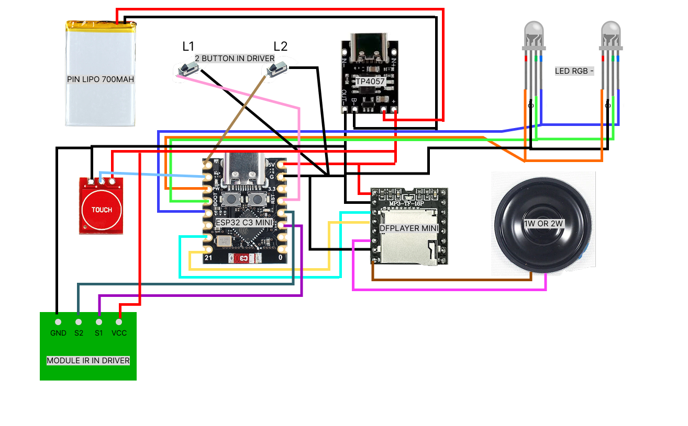

## Driver Decade – ESP32-C3

Mạch điều khiển hiệu ứng âm thanh, LED RGB và IR cho Decade Driver, sử dụng `ESP32-C3 Mini`, `DFPlayer Mini`, cảm ứng chạm và module IR trong driver.

---

## Sơ đồ kết nối phần cứng

---

## Bảng chân kết nối ESP32-C3

| Thiết bị                | Chân (ESP32-C3) |
| ----------------------- | --------------- |
| **DFPlayer Mini MP3**   |                 |
| TX (DFPlayer → ESP)     | GPIO20 (RX1)    |
| RX (DFPlayer ← ESP)     | GPIO21 (TX1)    |
| **Touch Sensor**        |                 |
| Touch 1                 | GPIO6           |
| **Switch (Input)**      |                 |
| L1 (Switch 1)        | GPIO4           |
| L2 (Switch 2)        | GPIO5           |
| **LED RGB (PWM)**       |                 |
| LED R                   | GPIO7           |
| LED G                   | GPIO8           |
| LED B                   | GPIO10          |
| **Digital Output / IR** |                 |
| S1_PIN (Output 1)       | GPIO2           |
| S2_PIN (Output 2)       | GPIO3           |

---

## Thông tin WiFi / Web config

- **WiFi SSID**: `Driver Decade`
- **WiFi Password**: `decade123`
- **Kiểu WiFi**: ESP32-C3 phát Access Point (AP), không cần router.
- **Địa chỉ IP mặc định**: thường là `192.168.4.1`  
  - Sau khi ESP32-C3 phát WiFi, dùng điện thoại / PC kết nối tới SSID trên,  
    rồi mở trình duyệt truy cập địa chỉ `http://192.168.4.1` để vào giao diện cấu hình `sound.json`, LED, Volume, Log, v.v.

